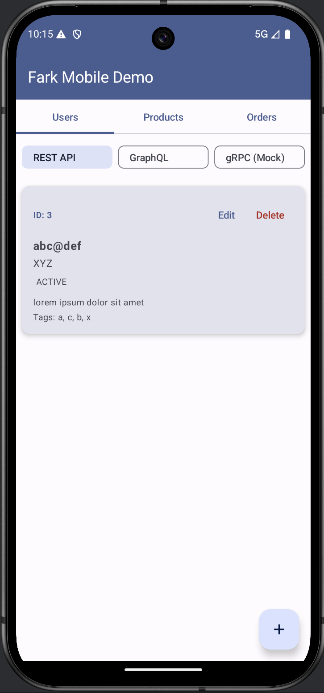

# Fark Mobile Demo (Kotlin/Android)

Android mobile application demonstrating REST, GraphQL, and gRPC API integration using modern Android development patterns.



## Tech Stack

- **Kotlin** for Android development
- **Jetpack Compose** for modern declarative UI
- **Ktor Client** for REST API
- **Apollo Kotlin 3** for GraphQL API
- **Coroutines + StateFlow** for reactive state management
- **Material Design 3** for UI components
- **ViewModel + Compose** architecture

## Requirements

- **Java 11+** (JDK 11 or higher)
- **Android Studio Hedgehog (2023.1.1) or later**
- **Android SDK 24+** (minimum API level 24)
- **Gradle 8.5** (included via wrapper)

## Project Structure

```
app/src/main/
├── java/com/fark/mobiledemo/
│   ├── MainActivity.kt                  # Main Compose activity
│   ├── models/
│   │   └── Models.kt                    # Data models (User, Order, Product)
│   ├── api/
│   │   ├── rest/
│   │   │   ├── RestApi.kt              # REST request/response models
│   │   │   └── RestApiClient.kt        # Ktor REST client
│   │   └── graphql/
│   │       └── GraphQLClient.kt        # Apollo GraphQL client
│   ├── viewmodels/
│   │   ├── RestUsersViewModel.kt       # REST API state management
│   │   ├── RestOrdersViewModel.kt
│   │   ├── RestProductsViewModel.kt
│   │   ├── UsersViewModel.kt           # GraphQL API state management
│   │   ├── OrdersViewModel.kt
│   │   └── ProductsViewModel.kt
│   └── ui/
│       ├── FarkMobileDemoApp.kt        # Main Compose app with navigation
│       ├── ApiType.kt                   # API type enum (REST/GraphQL/gRPC)
│       ├── screens/
│       │   ├── UsersScreen.kt          # Users list with API switching
│       │   ├── ProductsScreen.kt
│       │   └── OrdersScreen.kt
│       ├── components/
│       │   ├── UserCard.kt             # Compose card components
│       │   ├── ProductCard.kt
│       │   ├── OrderCard.kt
│       │   └── ErrorBanner.kt
│       ├── dialogs/
│       │   ├── UserDialog.kt           # Create/Edit dialogs
│       │   ├── ProductDialog.kt
│       │   └── OrderDialog.kt
│       └── theme/
│           ├── Color.kt                 # Material3 color scheme
│           ├── Theme.kt
│           └── Type.kt
└── graphql/
    └── com/fark/mobiledemo/
        ├── GetUsers.graphql             # GraphQL queries
        ├── CreateUser.graphql           # GraphQL mutations
        └── ... (other GraphQL operations)
```

## Quick Start

1. Ensure **Java 11+** and **Android Studio Hedgehog+** are installed
2. Clone repo and open in Android Studio
3. **File → Sync Project with Gradle Files**
4. Start backend on `localhost:3000`
5. Run app on emulator
6. Verify: Check Logcat for `RestApiClient: Using base URL: http://10.0.2.2:3000/api/`

## Setup Instructions

### 1. Clone and Open Project

```bash
git clone <repository-url>
cd fark-mobile-demo
```

Open the project in Android Studio.

### 2. Verify Java Version

Ensure you have **Java 11 or higher** installed:

```bash
java -version
```

If needed, set Android Studio to use Java 11+:
- **File → Project Structure → SDK Location → Gradle Settings**
- Set **Gradle JDK** to **JDK 11** or higher

### 3. Sync Gradle

Click **Sync Now** when prompted, or:
- **File → Sync Project with Gradle Files**

### 4. Backend Setup

The app expects the backend to be running on:
- **REST/GraphQL**: `http://localhost:3000`
- **gRPC**: `localhost:50051` (not yet implemented)

### 5. Emulator Configuration

The app uses `10.0.2.2` to connect to host's `localhost`.

### 6. Run the App

- Select an emulator or device
- Click **Run** (▶️)
- Verify in Logcat: Filter by `RestApiClient` and `GraphQLClient` to see connection logs

## Features

### API Integration

#### REST API (Ktor Client)
- **Base URL**: `http://10.0.2.2:3000/api/`
- **Endpoints**:
  - `GET/POST/PUT/DELETE /users` - User CRUD
  - `GET/POST/PUT/DELETE /orders` - Order CRUD
  - `GET/POST/PUT/DELETE /products` - Product CRUD
- **Features**: Full logging, no connection pooling, JSON serialization with Gson

#### GraphQL API (Apollo Kotlin 3)
- **URL**: `http://10.0.2.2:3000/graphql`
- **Queries**: `GetUsers`, `GetOrders`, `GetProducts`
- **Mutations**: `CreateUser`, `UpdateUser`, `DeleteUser`, etc.
- **Features**: Type-safe generated models, custom OkHttp client, detailed error logging

#### gRPC API
- **Status**: Mock implementation (screen available)
- **Planned URL**: `10.0.2.2:50051`

### UI Features

- **Tab Navigation**: Switch between Users, Orders, and Products
- **API Switching**: Toggle between REST, GraphQL, and gRPC (mock) for each entity
- **CRUD Operations**: Create, Read, Update, Delete via dialogs
- **Error Handling**: Error banner with dismiss functionality
- **Loading States**: Progress indicators during API calls
- **Material Design 3**: Modern, responsive UI with Material You theming

### Data Models

#### User
- Fields: `id`, `email`, `name`, `status`, `description`, `metadata`, `tags`, `paymentMethod`
- Enums: `UserStatus` (ACTIVE, INACTIVE, PENDING), `PaymentMethod` (CREDIT_CARD, DEBIT_CARD, PAYPAL)

#### Order
- Fields: `id`, `userId`, `productIds`, `status`, `total`, `discountCode`, `shippingAddress`
- Enums: `OrderStatus` (CREATED, PROCESSING, SHIPPED, DELIVERED)
- Nested: `Address` (street, city, zipCode, country)

#### Product
- Fields: `id`, `name`, `price`, `category`, `inStock`, `specifications`
- Nested: `ProductSpec` (key, value)

## Building

```bash
# Debug build
./gradlew assembleDebug

# Release build
./gradlew assembleRelease

# Install on connected device/emulator
./gradlew installDebug

# Run tests
./gradlew test

# Clean build
./gradlew clean build
```

## Network Configuration

### Emulator
- Uses `10.0.2.2` to access host's `localhost`
- Cleartext traffic enabled (see `AndroidManifest.xml`)

### Physical Device
If testing on a physical device, update the base URL in `app/build.gradle.kts`:

```kotlin
buildConfigField("String", "REST_API_BASE_URL", "\"http://<YOUR_IP>:3000/api/\"")
```

And in `GraphQLClient.kt`:

```kotlin
private val graphqlUrl = "http://<YOUR_IP>:3000/graphql"
```

## Dependencies

### Core
- `androidx.core:core-ktx:1.12.0` - Kotlin extensions
- `androidx.lifecycle:lifecycle-*:2.6.2` - ViewModel, StateFlow, Compose lifecycle

### Jetpack Compose
- `compose-bom:2023.10.01` - Compose bill of materials
- `material3` - Material Design 3 components
- `navigation-compose:2.7.6` - Navigation

### Networking
- `io.ktor:ktor-client-android:2.3.7` - REST client
- `com.apollographql.apollo3:apollo-runtime:3.8.2` - GraphQL client
- `com.google.code.gson:gson:2.10.1` - JSON serialization

### Async
- `kotlinx-coroutines-android:1.7.3` - Coroutines

## Troubleshooting

### Issue: "Gradle JVM is configured but Project JDK is invalid"
**Solution**: Set Gradle JDK to Java 11+ in Android Studio settings

### Issue: GraphQL queries fail
**Solution**: 
1. Ensure backend is running on `localhost:3000`
2. Check Logcat for detailed error logs (filter: `GraphQLClient`)
3. Verify emulator can reach host: `adb shell ping -c 1 10.0.2.2`

### Issue: Build fails with "Unresolved reference"
**Solution**: 
1. **File → Invalidate Caches / Restart**
2. **Build → Clean Project**
3. **Build → Rebuild Project**

## Testing with Fark.ai

When the backend introduces breaking changes (e.g., `email` → `emailAddress`), Fark.ai's frontend impact finder will:
1. Search this codebase for `email` references
2. Find them in: `RestApiClient.kt`, `GraphQLClient.kt`, `Models.kt`, ViewModels, UI screens
3. Report impacted files with line numbers and severity
4. Suggest fixes for Kotlin/Android code

## Architecture Decisions

### Why Jetpack Compose?
- Modern, declarative UI (less boilerplate than XML)
- Reactive by default (works well with StateFlow)
- Better integration with Kotlin coroutines

### Why Ktor instead of Retrofit?
- Pure Kotlin (better Compose integration)
- No connection pooling issues
- Simpler configuration for this use case

### Why Apollo Kotlin 3?
- Industry standard for GraphQL
- Type-safe generated models
- Built-in caching and normalization

### ViewModel + StateFlow Pattern
- Survives configuration changes
- Clean separation of concerns
- Easy to test
- Reactive UI updates

## License

MIT

## Contributing

This is a demo project for Fark.ai testing. Feel free to fork and modify for your own use.


